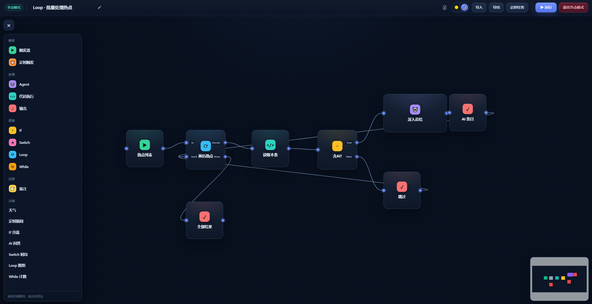
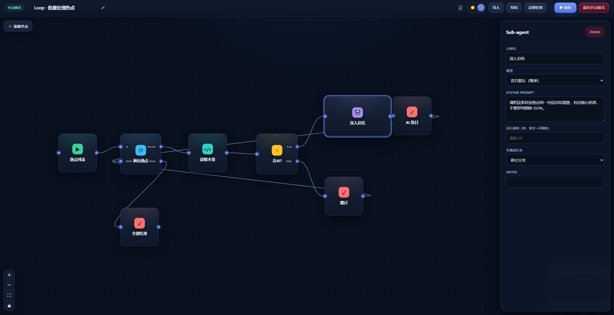
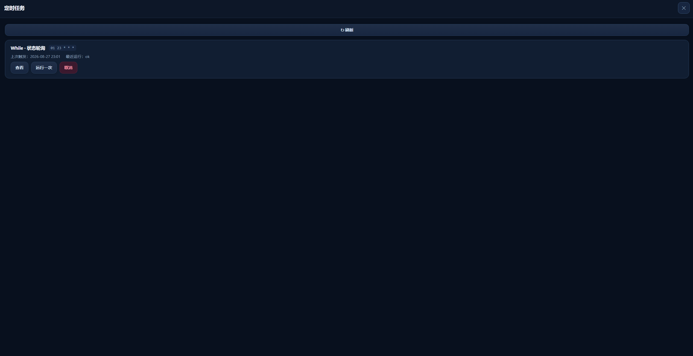

<div align="center">

# DSH Node Flow

[](./README.md)
[](./README.en.md)

### 为 DeepSeek Harness 提供可视化、可执行的节点工作流画布

用拖拽和连线组织触发器、子 Agent、代码、条件分支、循环与定时任务，直接在 DSH 中运行完整工作流。

[](./LICENSE)


</div>



<p align="center"><sub>从左侧节点面板添加节点，并在画布中完成拖拽编排</sub></p>

## 项目简介

DSH Node Flow 是一个面向 [DeepSeek Harness（DSH）](https://github.com/deepseek-ai/deepseek-harness) 的可视化工作流插件。它把 Agent 调用、TypeScript / Python 代码、条件判断和循环控制组合成一张可直接执行的流程图，适合快速搭建自动化任务和多步骤 Agent 流程。

## 核心能力

- **可视化编排**：拖拽节点、连接端口，在画布中直观看到数据和执行路径。
- **子 Agent 调用**：Agent 节点可继承当前模型，也可选择 DSH 已配置的模型路由。
- **代码节点**：支持 TypeScript 与 Python，并提供全屏代码编辑器。
- **流程控制**：内置 If、Switch、Loop 和 While，覆盖分支与循环场景。
- **执行反馈**：节点展示运行状态；实际经过的连接路径会高亮，方便定位流程走向。
- **失败策略**：Code / Agent 节点可设置超时，以及“停止分支”或“继续使用空值”。
- **定时任务**：通过 5 段 Cron 表达式保存工作流，在任务面板中查看、立即运行或取消。
- **导入与导出**：工作流可以保存为文件，便于备份、分享和复用。
- **内置文档**：顶部帮助入口包含节点字段、连线规则、结果语义和工作流示例。

## 界面预览

### 节点属性

选中节点后，可以在右侧属性面板配置名称、模型、提示词、超时和失败处理策略。



### 定时任务

定时任务面板集中展示 Cron 计划、上次触发时间和最近运行状态，并支持查看、立即运行或取消任务。



## 快速开始

### 安装

项目尚未发布到 npm，请直接从公开 GitHub 仓库安装：

```sh
dsh plugin --profile web add git+https://github.com/CodermanYHZ/dsh-node-flow.git
```

如果你是在 DeepSeek Harness 源码目录中运行 DSH，请使用：

```sh
pnpm dsh plugin --profile web add git+https://github.com/CodermanYHZ/dsh-node-flow.git
```

安装完成后重启 Web UI：

```sh
dsh web
```

源码运行方式对应为 `pnpm dsh web`。

进入 DSH 后，从侧边栏打开 **节点模式** 即可使用。

### 基本使用

1. 点击 **添加节点**，从左侧面板选择节点或内置示例。
2. 拖动节点端口建立连接，并在右侧属性面板填写参数。
3. 点击顶部 **▶ 运行**，观察节点状态与实际执行路径。
4. 使用 **导出** 将工作流保存为文件，或通过 **定时任务** 创建 Cron 调度。

## 节点类型

| 节点 | 用途 |
| --- | --- |
| **Trigger** | 工作流入口，将触发内容传递给下游节点。 |
| **Schedule** | 使用 5 段 Cron 表达式定时运行整个工作流。 |
| **Agent** | 调用 DSH 子 Agent，可继承当前模型或指定模型路由。 |
| **Code** | 在宿主运行 TypeScript 或 Python，读取上游输入并返回结果。 |
| **If** | 根据真值将流程分发到 `true` 或 `false`。 |
| **Switch** | 按值匹配 Case，未命中时进入 `default`。 |
| **Loop** | 遍历数组或重复 N 次，并收集每次循环结果。 |
| **While** | 条件成立时持续循环，并通过 `maxIters` 防止无限执行。 |
| **Output** | 使用 `{{result}}` 模板展示上游结果。 |
| **Note** | 在画布中添加说明，不参与执行。 |

## Code 节点 API

TypeScript 代码中可使用全局 `dsh` 对象：

```ts
const response = await dsh.fetch({
  url: "https://example.com/api",
  method: "POST",
  headers: { "Content-Type": "application/json" },
  body: { message: "hello" },
})

const previous = await dsh.input(null) // 读取上游节点输出
const now = await dsh.now(null)        // { iso, ts, local }

return response.json
```

Python 节点通过环境变量读取上游结果，并将标准输出作为节点结果：

```python
import os

previous = os.environ.get("DSH_INPUT", "")
print(previous)
```

> DSH Code Runtime 的绑定调用必须传入可无损 JSON 序列化的参数，因此应写成 `dsh.input(null)` 和 `dsh.now(null)`，不能省略参数。

## 运行环境

插件依赖 DSH 宿主提供以下服务：

- `ctx.webServer`
- `ctx.codeRuntime`（Code 节点）
- `ctx.agents` 与 `ctx.subagents`（Agent 节点）
- `ctx.llm`（模型路由列表）

React、ReactDOM 和 `@deepseek-ai/cordis` 由 DSH 作为 Peer Dependencies 提供。

## 本地开发

```sh
npm install
npm run dev       # 启动独立 Vite 预览
npm run build     # TypeScript 检查 + 客户端打包 + Demo 构建
npm test          # 运行测试
```

## 许可证

本项目基于 [MIT License](./LICENSE) 开源。
